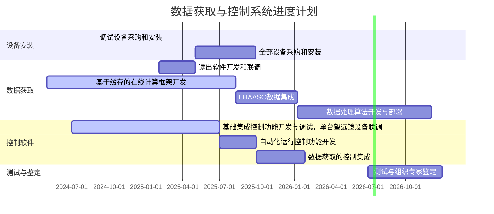

```mermaid
gantt
    title 数据获取与控制系统进度计划
    dateFormat YYYY-MM-DD
    todayMarker stroke-width:5px,stroke:#0f0,opacity:0.5
    
    section 设备安装
    调试设备采购和安装 :active, 2024-09-01, 2024
    全部设备采购和安装 :2025-05-01, 150d
    section 数据获取
    读出软件开发和联调 :2025-02-01, 90d
    基于缓存的在线计算框架开发 :active, b2, 2024-05-01, 465d
    LHAASO数据集成 :b3, after b2, 153d
    数据处理算法开发与部署 :after b3, 330d
    section 控制软件
    基础集成控制功能开发与调试，单台望远镜设备联调 :active, c1, 2024-07-01, 365d
    自动化运行控制功能开发 :c2, after c1, 90d
    数据获取的控制集成 :c3, after c2, 120d
    section 测试与鉴定
    测试与组织专家鉴定 :2026-07-01, 2026-12-31
```